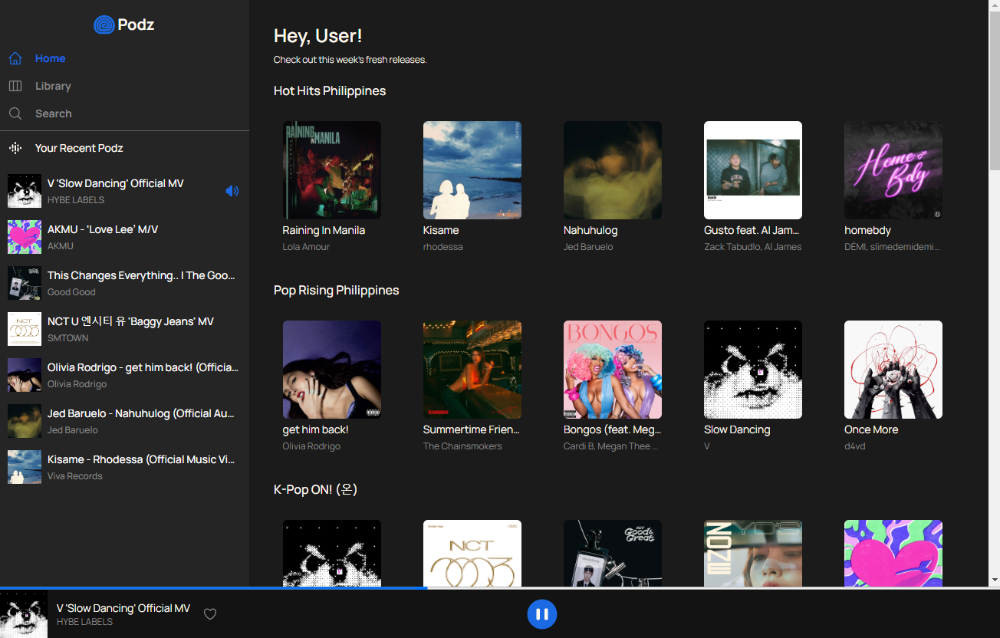

 

  

  <h3 align="center">Podz</h3>

  

    Music Player with Youtube as a source
     
     
    <a href="https://podz-music.vercel.app/">View Demo</a>
  

Podz is a music player inspired by the work of **Ruby Montalvo** in [Dribbble](https://dribbble.com/shots/22211302-Daily-UI-009-Music-Player) . This project uses Youtube as a source of audio, and Spotify for featured playlists. It can be used by both mobile and desktop users.

 

 

<!-- LICENSE -->
## License

Distributed under the MIT License. See `LICENSE` for more information.

<!-- ACKNOWLEDGEMENTS -->
## Acknowledgements

* Almira Ruby Montalvo  `Design`

